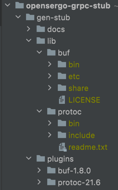

# gen-stub 使用

- `gen-stub/plugins`目录下选择操作系统对应的安装包，解压放到`lib目录`下,并且重命名为`buf`和`protoc`，如图   
  
- 在`gen-stub`目录下配置要生成的`stub`语言
- 在`gen.sh`中配置 [`buf/build`中央仓库](https://buf.build/opensergo) 中`opensergo/opensergoapis`的版本
- 执行`gen.sh`